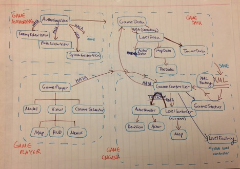
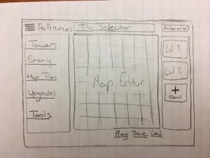
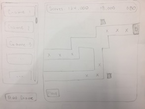
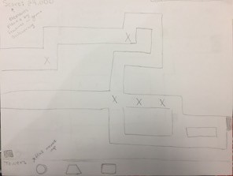
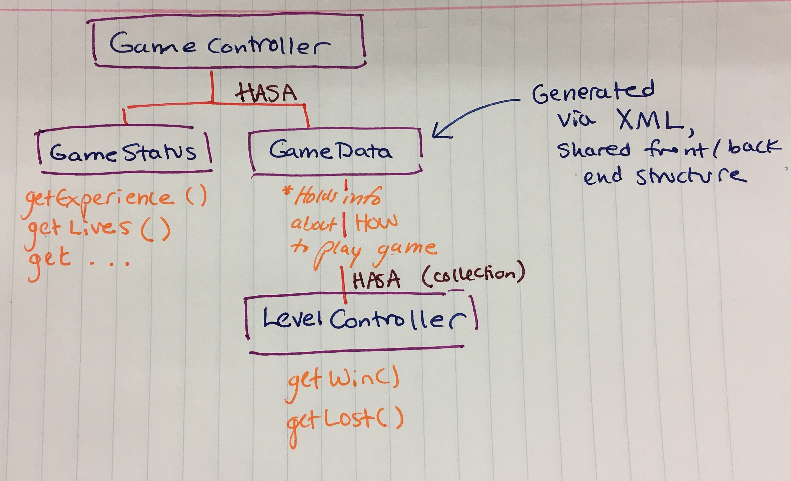
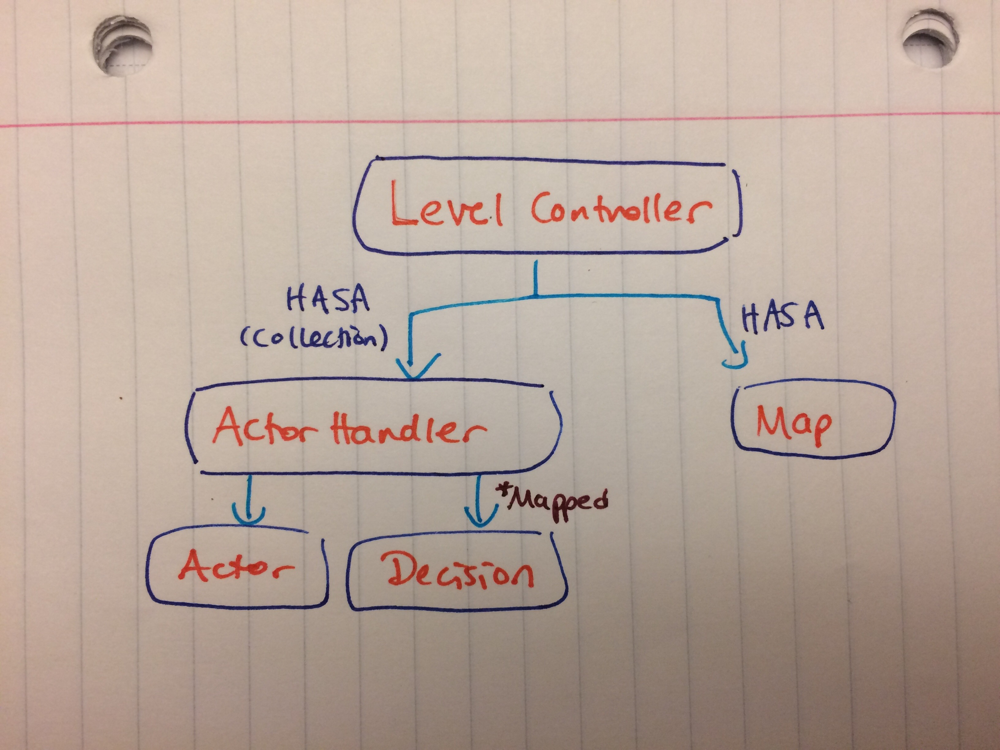
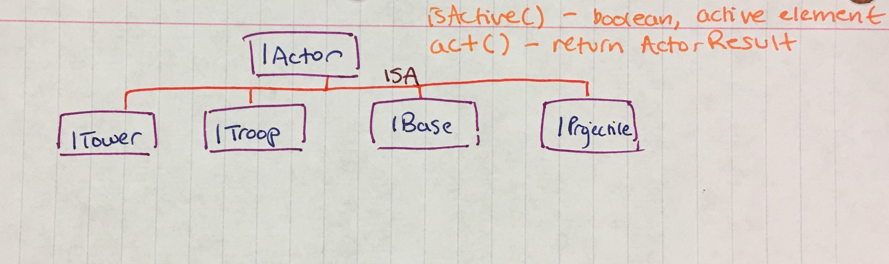

##DESIGN Document for Team ILoveSingletons

### Introduction

Above all, our code must be **intuitive and well-documented.** We are working with a team of 10 people, and many of the modules will rely heavily upon each other and use overlapping data structures.  In order to minimize duplicated code and misuse of subcomponents, we will have to be careful about explaining each element. Furthermore, in order to add similar/new features in future sprints, one must be able to navigate the code without spending too much time playing catch-up. Complicated code is much harder to extend. 

Likewise, the components of the program should only contain **clear dependencies** -- no back-door dependencies. Clear dependencies, though certainly worse than no dependencies at all, are at least manageable. This project is so large than hidden dependencies could wreak havoc on functionality -- we want things to be as easily changed and modified as possible so that we can accommodate several different work flows at the same time.

Finally, we will follow the **open-closed principle** -- our project should have certain basic code that is closed to alteration (e.g., the foundation of each module), but other components that are open to extension via inheritance. Because we will have many different subteams working together, we cannot change foundational code once it has been written -- other components will depend upon this implementation. We can, however, extend already existing structures to add new functionality. For instance, adding new types of towers would require extension of the Tower class. The Tower class is closed to modification (as many other components will depend upon it), but extension of the class can allows for modification to functionality.

The primary modules (game player, game engine, game authoring environment, game data) will need to be based upon closed components. Other modules will build upon this code with a certain expectation for the results of these calls -- hence, changes after initial authorship will be undesirable. 

Tower defense games involve a set of enemies progressing from one end of a path to another end, and these enemies can be defeated by attacks from placed towers. The design needs to be flexible in order to accommodate different types of paths, towers, and enemies, as well as flexible rule sets (the user may control the enemies instead of the towers, for example).

### Overview

**Abstract Game Modules:** This module forms the basis for both the Game Player and the Authoring Environment. It essentially connects them by ensuring that the authoring environment. The game modules instantiate necessary classes for the Game player to use based on the XML files passed to it from the Game Authoring Engine. 

**Game Player:** this part of the program displays the games that have been created by the game authoring environment, and allows users to play the games that have been created. It reads in the game files created by the game data portion to load games. It should also be capable of saving its own data: mid-game saves, high scores, etc.

**Authoring Environment** this part of the program provides the user with an interactive map screen and allows them to drag in objects, create paths, and program enemy behavior. This class will only communicate with the rest of the program via an XML file (MOVE THIS). Abstract classes for different tower types, allowing user to select built-in tower stats/level progressions.  

- **Game Player:**
	- HUD (View element)
		- Tracks score
		- Health / Lives
		- Level update
		- Various display options
	- Map (View element)
		- Displays the main area for the game
		- Contains all towers, enemies, and path
	- Menus (View element)
		- Towers
			- Allows the user to select the towers to place into the map
		- Options
			- Loading/saving
			- Pause/play
			- Quit to main menu
			- Quit to game selection
			- Sound settings
		- Help
			- Links to the instruction manual for the game (HTML page)
	- GUI / View 
		- Holds map, menus, etc. and displays them
		- Provides interface for interacting with the game
		- Communicates user actions to Controller
	- GameSelector (View element)
		- Allows the user to choose between different games
		- Shows high scores for games
	- GamePlayer (controller)
		- Runs animations
		- Starts/stops the game
		- Communicates between View and Model
	- Model
		- Holds the game’s state
		- Contains instructions for motion of enemies, tower attack pattern, etc
		- Contains the grid of all objects
		- Communicates with Controller to display state in View
- **Game Engine:**
	- Actor
		- Anything that can “act” during a game
		- Descendents include Tower, Projectile, Troop, Base, etc.
		- Capable of being active or inactive during a run depending upon user input
	- Path
		- A collection of Tiles that represents the path for an Actor (as a graph perhaps)
		- Capable of returning the first and last Tile in the path (needed to place enemies)
	- GameController
		- Main controller while the game is running
		- Has both a GameStatus and GameData object to represent the game being run
	- GameStatus
		- Holds information specific to current game
		- Unique from GameData in that this information is generated as the game is played
		- Holds things like experience, points, etc.
	- GameData
		- Represents data needed to run a game (e.g., types of towers, enemies)
		- Generate via XML
		- Shared between front and back end
		- Represented via subcomponents like TileData, MapData, etc.
	- LevelController
		- Controls a specific level
		- Has conditions for winning and losing the level
		- Held as a Collection in the GameController
	- Map 
		- Holds the information of all tiles and what is on it ( enemy, tower, …)
		- Each tile has an index (ex: 0,0), each actor will have a xy-coordinate 
		- The map class has methods for finding the tile index given the xycoordinate 
- **Game Authoring Environment:**
	- AuthoringView: The container view that holds all the rest of the UI components.
	- MapEditorView:  This holds Tile objects and allows the user to customize the appearance and features of the tiles that compose the Map.
	- LeftPaneView: This pane holds the Buttons that call up various EditorViews for customizing various aspects of the Game, like Enemy, and Tower, ands Path
	- LevelEditorView: This holds LevelData objects and has instances of various Levels, each containing a map and a collection of data about the game.  
	- TileSelectorView: This view is on top of the MapEditorView. It’s basically a shortcut for changing the selected tile when editing the mapview.
	- PreferencesMenuView: This menu view is accessible through the menu button on the top left corner. It slides in the view, and allows the user to modify game rules and preferences.
	- XML: This package holds the classes that transform a GameData into an XML file and vice versa.
- **Game Data**:
	- General layout:
		- The GameData is a subcomponent shared between the front and back end
	- Will have capability to transform both from and to XML via an XML Factory
	- Will act as parameter for backend objects like Tower, Troop, etc. (the GameData object will have to be passed to a LevelFactory to generate the instances required for that level).
	- Basic classes for GameData:
		- GameData: Holds general information about the specific game
		- LevelData: Holds individual information for specific levels, such as enemies
		- MapData: Holds a Collection of TileData objects
		- TileData: Objects representing information about each Patch in the grid
		- ActorData: Information about the actors in play (towers, projectiles, etc.)
		- TowerData: Information about towers (e.g., type, range)
			- Unlocked by game play -- not level specific

### User Interface

**Game Player:**

The user will be able to access the various objects such as towers and enemies allocated by the given file read in. With these objects, they will be able to click and drag them over into the main space. They will be able to see in real time (while the game is playing) their current score, health, and other similar attributes in the HUD. They will be able to save their progress and reload or quit / change the current game through several button objects. Later the user can see their previous scores and current best on a separate score screen.

**Authoring Environment: **

The user will be able to create several types of and different variations of the tower defense game. The user will be able to define the map, enemies, towers, upgrades, game preferences, and levels. Furthermore, the user will have several powerful tools at his disposal to help him accelerate the game creation process. Two of these tools are the level automator and image-to-map converter. With the level automator, the user can create any number of levels given a level object or (list of level objects which define a loop) and defining the growth function of the enemy. 

- **Map Editor View:** this is a GridView of Tile objects. Each Tile object is a javafx view that holds a TileData object. The user is able to edit the visual and backend aspects of the map through this map editor view.
	- Right Pane: the right pane contains the LevelsContainerView. This object is a vertical scrollview with LevelView objects. Each LevelView is a javafx object that contains a LevelData object. The user is able to edit the LevelData object by typing in specific properties of the level such as the number and types of enemies.
	- Left Pane: This pane contains a list of buttons. Each button causes the pane to flip over to its back (like a card flipping from one side to the other) and display the corresponding view. For instance, the Towers button will display the TowerEditorView. 
		- Tower Button: Displays the the Tower Editor View
		- Enemy Button: Displays the Enemy Editor View
		- Map Tiles Button: Displays the Tile Editor View
		- Tools Button: Displays the Tools View, a view that holds the links to external modules such as Level Automator and ImageToMap Converter
	- Top Pane:
		- Menu button that slides in a menu of preferences.
		- Tile Selector View: a horizontal-scroll-view of tiles that the use has created.

**Possible Errors That Could be Encountered:**

**Game Player:**

If data or save files are not properly formatted or unavailable for a game, an error dialog box should pop up alerting the user that the game files are bad. If the user takes a forbidden action in the middle of the game, an overlay message should alert the user that the action is not allowed.

**Authoring Environment: **

Map Errors:
User creates a map with a faulty path. The way we check for this error is by making sure that there is a path to the EntryTile and ExitTile from every single PathTile on the screen. 

Missing EntryTile or ExitTile: This occurs when there is either one of these tiles and they are not connect to the other one, like an EntryTile that does not lead to an ExitTile

Actor Error:
Invalid input: this happens when the user enters an invalid number for an actors property.

### Design Details

**Game Engine:**
The game engine is controlled via the game controller, which keeps track of the overall game information and the specifics for each level. The game specific information like experience, lives, etc. are held in the GameStatus object. The level specific items are generated from the GameData object, which can be called upon to create level specific information (actors, map). These bits of data are held in the LevelController, which holds a collection of ActionHandlers (mappings of Actors to Decisions they make within the game, like Shoot, Move, etc.) and also holds a Map for the level. The smallest subcomponents in the game engine are Actors, which branch off into subcomponents like Troop, Tower, Base and Projectile.

- **Game Path:**
	- Game engine takes in the location coordinate of tiles and their types from XML. In the XML, a tile is represented with grid index such as 0,0 and has one of the four types: start (source) , end (destination), walkable, non-walkable.  
	- Represent the walkable path as a graph with tile nodes
	- Using shortest path algorithm to find the path to the base tile. Allow for shortest path finding for many sources to many destinations, one source to one destination, many sources to one destination, one source to many destinations.
	- Each tile node may contain a weight value. For future extensions such as Troop having the ability to find paths with the least towers, placing a tower in a tile will add weight to the walkable tiles near it. 
	- IPathFinder will find direction to move from every tile node (may treat it as an utility for enemy). It has a getNext(Actor ) or getSuccessor(Actor ) method that takes in an Actor, analyse its current tile position, and gives the next tile position to go that correspond to the shortest path towards the destination. 

- Alternate design (preferred) 
	- IPathFinder: 
		- Collection<Directions> getDirection( Tile currentTile): provide the direction(s) for any Actor that is within the currentTile to move next. This means the Actor should have a method that return the tile that it is currently on. The direction could be an enum type (like left, right, up, down). The direction(s) are computed by calculating the number of towers along the path backtracking from the end tile to the currentTile
		- Tile getStartingTile() get the starting tile (this could be a collection of tiles for games with multiple starts and ends) 
		- Tile getEnding Tile() get the ending tile 

PathFinder class has an instance of the map that contains all tiles and all towers, and pass recommended direction(s) correspond to the path(s) with the least towers along them. Initially when there is no towers, it will choose the path that has the minimum number of tiles. When user adds in tower as the game goes, the algorithm may favor paths with minimum number of towers.
Note that each tile contains a set of possible directions that an Actor can go if they are currently in that tile. This set of possible directions are based on the neighboring tiles which are walkable tiles. 

**Game Player:**

The game player module determines the interaction of individual components of the game engine when a game is run, taking in the specifications of an individual game as specified by an XML file. The game player is thus broken up into several individual smaller components of an overarching “GamePlayer” that oversees the initiation of a game as well as actions during a given game. The GamePlayer has agency over individual “LevelController” components that dictate how a level progresses.

**Game Authoring Environment:**

The main classes for the Authoring Environment are the AuthoringView and AuthoringController. The AuthoringController holds the AuthoringView and all of the related UI components, as listed below:

- MenuView
- MapEditorView
- PathTile: a cell in the map GridView that holds TileData
- TileSelectionView
- TileEditorView
- EnemyEditorView
- TowerEditorView
- LevelEditorView
- Various Buttons (Load, Save, etc)

The relationship between AuthoringController and these sub-components is that of a container-part relationship. So, none of the sub-components have a reference to AuthoringController. However, there will be cases in which these subcomponents need to access specific methods in the AuthoringController. In such cases, the AuthoringController needs to pass those methods as Functions/Consumers in the constructor of the subcomponent. This way, the subcomponent will hold a reference to the method that it needs so that it can invoke it at any time. To give an example, the TileSelectionView will want to let MapEditorView know which tile the user selected. However, only AuthoringController has the reference to both of these objects, and consequently only class that can access the public functions of MapEditorView. AuthoringController would then have a method that calls MapEditorView.setSelectedTile(PathTile tile) and TileSelectionView can call that method by using the Function that it stored during initialization. To summarize the chain of the events:

TileSelectionView calls Function.setSelectedCell(tile) -> then calls AuthoringController’s setSelectedCell(tile) -> which then calls MapEditorView’s setSelectedCell(tile)

As for dependencies, the Authoring Environment heavily depends on the data structures that constitute a game. These data structures are defined by the abstract data objects that the Authoring Environment shares with the Game Engine. 

**Game Data:**

GameData is encompassed in a data structure that holds all of the data for towers, levels, actors, etc. These are constructed in the authoring environment, saved using the XMLFactory and reloaded when the game is launched. These data structures can be used to generate actual level environments via the LevelFactory. 

Initial Design:

The game engine accommodates flexible game design by creating a careful hierarchy for the Actors, Towers, etc. so that inheritance will allow for the addition of new object types (e.g., a specialized/ upgraded tower descends from a Tower but has added functionality). The game engine also allows for each level to have its own implementation by controlling the game via LevelControllers (each having information specific to a level).  

The game data module accommodates the generalized storage of game information via a GameData structure that is taken in by the XMLFactory and converted from XML to GameData and back (for saving and re-loading).

Likewise, all of the components are meant to be integrated in order to allow for reusability and future extension -- hence, we share data structures to make the job easier. This includes the shared data structure GameData which is created in the Game Authoring Environment, translated to XML (saved), restored via the XML factory and used in the GamePlayer and GameEngine.

In the game engine, several major components were made into superclasses (either interfaces or abstract classes) because of how many different instances of these appear throughout the backend. As a result, Tower, Projectile, Base and Troop are descended from a shared class Actor, and specific instances of these items can be described via inheritance with the subclasses. This was done to allow for extension of the game (e.g., new towers, new enemies). 

Other components throughout the design are abstracted to allow for future flexibility. For instance, the views allowed on the frontend descend from a UIView superclass to add for the addition of new types of game pieces. 

### Example Games

**Bloons Tower Defense**

A set of enemies progress along a path from one end to the other. The player can place towers that have a variety of different attacks with limited range, that attack the enemies as they progress along the path and come into the range of the tower. Towers have different types of attacks (fire, bombs, darts, etc.), and enemies are sometimes resistant to certain types of attacks. Different classes of enemies also have more health, may move faster, and may also regenerate over time. One of the enemies’ health points translates to one dollar when it is attacked, which can be spent on purchasing towers or upgrades. If enemies make it all the way to the end of the path, the player loses a number of lives equal to the amount of health the enemy has left. The player wins after a certain number of rounds has passed, or if all of the player’s lives have run out.

**Plants vs. Zombies**

There are multiple parallel paths for enemies to take, and enemies may not change paths. Enemies have different amounts of health, move faster or slower, or have special types of attacks. Towers are placed directly in the path of the enemies, and the enemies must destroy towers on the way to their destination. Some towers have attacks, others only serve as defense. The player generates money with a specific type of tower - the money generating tower produces money at set intervals. This money is spent on purchasing towers. Enemies drop coins which can be spent between levels on purchasing new types of towers, or upgrading existing towers. The game is over when any one enemy progresses all of the way to the end of its path.

**FieldRunners**

The path decided on by the enemies is determined by the placement of towers in the map. The movement on the map is free, meaning that individual enemy units are able to move to any point on the map that they choose, so long as there is no restriction that blocks their path. These restrictions are put into place through the use of towers, which delineate the paths that are allowed to be taken by the enemy units. The game ensures that a tower cannot be placed in a way that the end goal of the game cannot be reached by the enemy units. The end game is determined in the same way that a game like Bloons Tower Defense is determined, and the upgrades and tower purchase mechanic is done in a similar mechanic as well.

**Differences that must be accommodated**

**Bloons Tower Defense:** Bloons tower defense assumes that once a tower is placed, it cannot be moved. It can be upgraded or sold, but not moved. It also assumes that there is a health point system, which, upon reaching 0, ends the game. The hp will either be removed when a “balloon” hits the base or passes off of the screen, depending on the game mode. Also, bloons supports placing towers during the running of a simulation. There is also generally a path from which the “balloons” can travel on. 
**Plants vs. Zombies:** The primary difference between bloons tower defense and PvZ is that bloons almost always has a specified path and PvZ usually allows the whole map to be walked on. Additionally, PvZ usually implements destructible units, like destroyable towers and a destroyable base (when attacked by a zombie for example). 
**FieldRunners:** The main additional feature added through the FieldRunners game is to alter the path of the game in realtime with the towers. The path that the various enemies take must be able to change immediately when a tower is placed, meaning that the implementation of the pathfinding must account for changes in the possible paths.

### Design Considerations 

Game Player: 

We talked a lot about visual elements within the game and whether or not menus, the HUD, etc. should be “fixed” regions in the game display, and information from the authoring environment simply populated this region. This would be the easiest solution, but limits flexibility. We decided instead to let the game authoring environment custom make these visual elements to allow for more flexibility and control on the game designer’s end.

Game Authoring: 

An assumption for now is that the game designer will place paths and objects in a grid. Thus, the game path is a collection of tiles where game objects can move from tile to tile. In order to allow the user to customize how and where certain menus appear, some communication is necessary with the game player.  We considered putting this information in the XML document with gamedata, since this would be the most convenient, but this forces some duplication of code to reconstruct the visual objects from the XML. Instead, we decided that the Authoring environment should generate the menus and populate them with relevant objects, and then using serialization these menus can be passed to the game player.

Game Engine: 

**1. Passing a map:** Most actors require a Map to make their decisions (e.g., to move, attack), but we did not want to relinquish unnecessary control over the Map to these classes by passing the entire Map. Instead, we opted for a Tile-based system where each Tile holds information about where the enemy should move. 

**2. Path:** For a while, we had the Path as its own class, capable of generation of a path through the map, returning the next tile, returning the first tile, etc. We soon realized, however, that the Path was to inextricably linked to the Map to not give the Map control over the Path as one of its components. 

Game Data:

Currently, all of the GameData is floating around as a collection of subcomponents that each hold information unique to its target class (e.g., a TowerData class holds information specific to tower type). We assumed that each Data object would implement a Data interface, but struggled to come up with shared functionality. This is something that still needs to be ironed out. 
